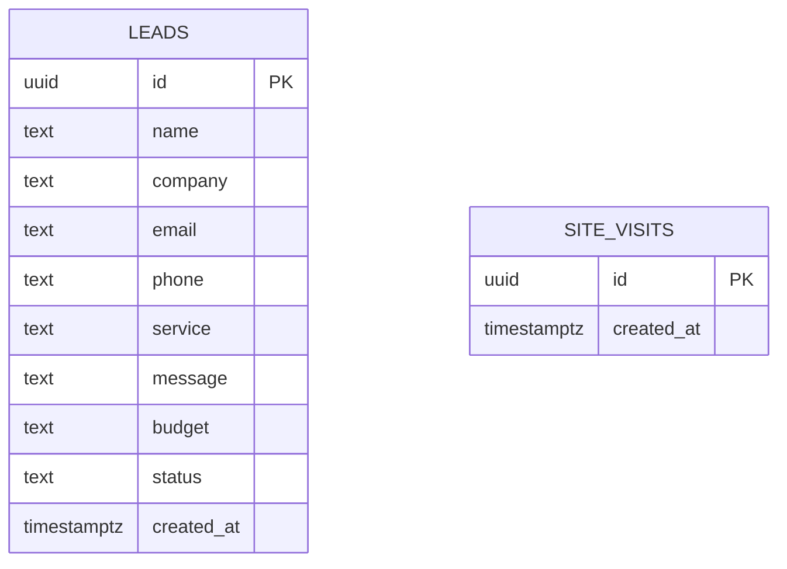

# DESIGN.md — ฐานข้อมูล + ข้อตกลงเรื่อง API

> ### ⚠️ ทุกทีมใช้ฐานข้อมูลตัวเดียวกัน — **ตารางต้องขึ้นต้นด้วย `t09_`**
>
> ตารางของทีมนี้ต้องชื่อ `t09_xxx` เช่น `t09_contacts`
> แก้ให้ครบทั้ง ER diagram ข้างล่าง · `db/migrations/*.sql` · และทุก `.from("...")` ในโค้ด
> **ห้ามแตะตารางที่ขึ้นต้นด้วยเลขทีมอื่น**


> 🤖 **สร้างและปรับปรุงตามข้อกำหนดใน `SPEC.md` §4**
> Backend และ Frontend ต้องใช้ข้อตกลงนี้ร่วมกันเพื่อให้การพัฒนาสอดคล้องกัน

---

# ส่วนที่ 1 · ฐานข้อมูล



## 1.1 `leads`
เก็บข้อมูลผู้สนใจและรายละเอียดโครงการจากแบบฟอร์มหน้า `/contact` (T2)

| คอลัมน์ | ชนิด | Null | Default | คำอธิบาย |
|---|---|---|---|---|
| `id` | uuid | ❌ | `gen_random_uuid()` | Primary Key รหัสประจำ Lead |
| `name` | text | ❌ | | ชื่อ-นามสกุล ผู้ติดต่อ (2–100 ตัวอักษร) |
| `company` | text | ✅ | `null` | ชื่อบริษัทหรือองค์กร (ไม่เกิน 150 ตัวอักษร) |
| `email` | text | ❌ | | อีเมลสำหรับติดต่อกลับ |
| `phone` | text | ❌ | | เบอร์โทรศัพท์ติดต่อ (9–10 หลัก) |
| `service` | text | ❌ | | บริการที่สนใจ (Website Development, Web Application, Mobile Application, UX/UI Design, Custom Software) |
| `message` | text | ❌ | | รายละเอียดความต้องการของโครงการ (10–2000 ตัวอักษร) |
| `budget` | text | ✅ | `null` | งบประมาณโดยประมาณ |
| `status` | text | ❌ | `'NEW'` | สถานะ: `NEW`, `CONTACTED`, `DISCUSSING`, `QUOTATION`, `CLOSED` |
| `created_at` | timestamptz | ❌ | `now()` | วันที่และเวลาที่บันทึกข้อมูล |

- **Indexes:**
  - `idx_leads_created_at`: `created_at DESC` (สำหรับเรียงลำดับรายการล่าสุดในหน้า Admin)
  - `idx_leads_status`: `status` (สำหรับ filter สถานะ)
- **RLS:** เปิดใช้งาน (Enable RLS) โดยไม่อนุญาตให้ `anon` เข้าถึงโดยตรง จัดการผ่าน Route Handler ด้วย `SUPABASE_SERVICE_ROLE_KEY` ฝั่ง Server เท่านั้น

---

## 1.2 `site_visits`
เก็บบันทึกการเข้าชมเว็บไซต์เพื่อนับสถิติการใช้งานรวม (G7)

| คอลัมน์ | ชนิด | Null | Default | คำอธิบาย |
|---|---|---|---|---|
| `id` | uuid | ❌ | `gen_random_uuid()` | Primary Key รหัสการเข้าชม |
| `created_at` | timestamptz | ❌ | `now()` | วันที่และเวลาที่เข้าชมเว็บไซต์ |

- **Indexes:**
  - `idx_site_visits_created_at`: `created_at DESC`
- **RLS:** เปิดใช้งาน (Enable RLS) เข้าถึงผ่าน Server Route Handler ด้วย `SUPABASE_SERVICE_ROLE_KEY`

---

## 1.3 กติกา Migration
- ทุกการเปลี่ยน schema = ไฟล์ SQL ใหม่ใน `db/migrations/` ชื่อ `NNN_ชื่อสั้น.sql`
- **ห้ามแก้ไขไฟล์เดิมที่รันไปแล้ว** ให้เพิ่มไฟล์ใหม่เสมอ
- รัน migration ผ่านคำสั่ง `npm run migrate`

---

# ส่วนที่ 2 · ข้อตกลงเรื่อง API

## 2.1 รูปแบบมาตรฐาน (ทุก endpoint ต้องตอบแบบนี้)

```json
// สำเร็จ (HTTP 200 / 201)
{
  "ok": true,
  "data": {}
}

// ไม่สำเร็จ (HTTP 400 / 404 / 500)
{
  "ok": false,
  "error": {
    "code": "VALIDATION_ERROR",
    "message": "ข้อความภาษาไทยที่แสดงให้ผู้ใช้เห็นได้เลย",
    "fields": {
      "email": "กรุณากรอกอีเมลให้ถูกต้อง"
    }
  }
}
```

| HTTP Status | ใช้เมื่อ |
|---|---|
| 200 / 201 | สำเร็จ / สร้างข้อมูลใหม่สำเร็จ |
| 400 | ข้อมูลนำเข้าไม่ผ่าน Validation (คืน error fields เป็นภาษาไทย) |
| 401 | ไม่ได้รับอนุญาต (Unauthorized) สำหรับ Admin |
| 404 | ไม่พบข้อมูลที่ต้องการ |
| 500 | เกิดข้อผิดพลาดภายในระบบ — **ห้ามส่ง stack trace หรือ secret ออกไปเด็ดขาด** |

---

## 2.2 `GET /api/health` (T6)
ใช้สำหรับตรวจสอบความพร้อมของระบบหลัง deploy

- **Response (200 OK):**
```json
{
  "ok": true,
  "data": {
    "status": "healthy",
    "time": "2026-09-06T10:00:00.000Z"
  }
}
```

---

## 2.3 `POST /api/leads` (T2)
รับข้อมูลจาก Project Brief Form หน้า `/contact` และบันทึกลงตาราง `leads`

- **Request Body:**
```json
{
  "name": "สมชาย ใจดี",
  "company": "บริษัท สยามนวัตกรรม จำกัด",
  "email": "somchai@example.com",
  "phone": "0812345678",
  "service": "Web Application",
  "message": "ต้องการพัฒนาระบบจัดการสต็อกสินค้าและเชื่อมต่อ API กับระบบเดิม",
  "budget": "100,000 - 300,000 บาท",
  "consent": true
}
```

- **กฎ Validation ฝั่ง Server (Zod):**
  - `name`: string, 2–100 ตัวอักษร (`กรุณากรอกชื่อ-นามสกุล`)
  - `company`: string optional, ไม่เกิน 150 ตัวอักษร (`ชื่อบริษัทต้องไม่เกิน 150 ตัวอักษร`)
  - `email`: email format, ไม่เกิน 255 ตัวอักษร (`กรุณากรอกอีเมลให้ถูกต้อง`)
  - `phone`: regex ตัวเลข 9–10 หลัก (`กรุณากรอกเบอร์โทรศัพท์ให้ถูกต้อง`)
  - `service`: enum ใน 5 บริการที่กำหนด (`กรุณาเลือกบริการที่สนใจ`)
  - `message`: string, 10–2000 ตัวอักษร (`กรุณาระบุรายละเอียดโครงการอย่างน้อย 10 ตัวอักษร`)
  - `budget`: string optional
  - `consent`: boolean ต้องเป็น true (`กรุณายอมรับนโยบายความเป็นส่วนตัวก่อนส่งข้อมูล`)

- **Response เมื่อสำเร็จ (201 Created):**
```json
{
  "ok": true,
  "data": {
    "id": "c3b8893c-2321-4d37-bd01-3829ad30e527",
    "createdAt": "2026-09-06T10:00:00.000Z"
  }
}
```

- **Response เมื่อข้อมูลไม่ถูกต้อง (400 Bad Request):**
```json
{
  "ok": false,
  "error": {
    "code": "VALIDATION_ERROR",
    "message": "ข้อมูลไม่ถูกต้อง กรุณาตรวจสอบและกรอกใหม่อีกครั้ง",
    "fields": {
      "email": "กรุณากรอกอีเมลให้ถูกต้อง",
      "phone": "กรุณากรอกเบอร์โทรศัพท์ให้ถูกต้อง"
    }
  }
}
```

---

## 2.4 `POST /api/visits` (G7)
บันทึกการเข้าชมเว็บไซต์เมื่อมีผู้ใช้งานเปิดหน้าเว็บ

- **Request Body:** `{}`
- **Response (201 Created):**
```json
{
  "ok": true,
  "data": {
    "id": "e4a29a1b-1823-492f-b420-5690b21a8d01",
    "createdAt": "2026-09-06T10:00:00.000Z"
  }
}
```

---

## 2.5 `GET /api/admin/leads` (T3, G6, G7)
ดึงรายการ Leads และข้อมูลสรุปสถิติสำหรับหน้า Admin Dashboard

- **Response (200 OK):**
```json
{
  "ok": true,
  "data": {
    "stats": {
      "totalVisits": 1420,
      "totalLeads": 38,
      "newLeads": 12,
      "inProgressLeads": 18
    },
    "leads": [
      {
        "id": "c3b8893c-2321-4d37-bd01-3829ad30e527",
        "name": "สมชาย ใจดี",
        "company": "บริษัท สยามนวัตกรรม จำกัด",
        "email": "somchai@example.com",
        "phone": "0812345678",
        "service": "Web Application",
        "message": "ต้องการพัฒนาระบบจัดการสต็อกสินค้า...",
        "budget": "100,000 - 300,000 บาท",
        "status": "NEW",
        "created_at": "2026-09-06T10:00:00.000Z"
      }
    ]
  }
}
```

---

## 2.6 `PATCH /api/admin/leads/:id` (G6)
อัปเดตสถานะของ Lead

- **Request Body:**
```json
{
  "status": "CONTACTED"
}
```
- **กฎ Validation:**
  - `status`: ต้องเป็นหนึ่งใน `'NEW' | 'CONTACTED' | 'DISCUSSING' | 'QUOTATION' | 'CLOSED'` (`สถานะไม่ถูกต้อง`)

- **Response (200 OK):**
```json
{
  "ok": true,
  "data": {
    "id": "c3b8893c-2321-4d37-bd01-3829ad30e527",
    "status": "CONTACTED"
  }
}
```
