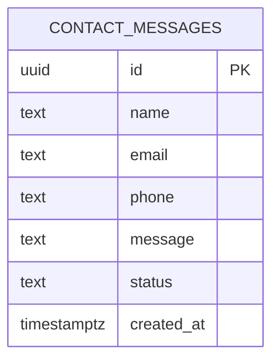

# DESIGN.md — ฐานข้อมูล + ข้อตกลงเรื่อง API

> ### ⚠️ ทุกทีมใช้ฐานข้อมูลตัวเดียวกัน — **ตารางต้องขึ้นต้นด้วย `t09_`**
>
> ตารางของทีมนี้ต้องชื่อ `t09_xxx` เช่น `t09_contacts`
> แก้ให้ครบทั้ง ER diagram ข้างล่าง · `db/migrations/*.sql` · และทุก `.from("...")` ในโค้ด
> **ห้ามแตะตารางที่ขึ้นต้นด้วยเลขทีมอื่น**


> 🤖 **ให้ AI Agent ร่างจาก `SPEC.md` ด้วยคำสั่ง `/design`** แล้วทีมตรวจแก้ทุกบรรทัด
> Backend ดูแลไฟล์นี้ แต่ **Frontend ต้องอ่านและเห็นชอบ** ก่อนเริ่มเขียนโค้ด
> ตกลงกันที่นี่ให้จบ แล้ว FE กับ BE ค่อยแยกกันไปทำพร้อมกันโดยไม่ต้องรอกัน

---

# ส่วนที่ 1 · ฐานข้อมูล

> ⚠️ ทุกอย่างในไฟล์นี้เป็น **ตัวอย่างให้ดูรูปแบบการเขียน** ไม่ใช่คำตอบ
> ตารางและ endpoint จริงต้องมาจาก `SPEC.md` §4 ของทีมเอง — **ลบตัวอย่างทิ้งได้เลย**



## contact_messages
เก็บข้อความจากฟอร์มหน้า `/contact`

| คอลัมน์ | ชนิด | Null | Default | คำอธิบาย |
|---|---|---|---|---|
| `id` | uuid | ❌ | `gen_random_uuid()` | Primary key |
| `name` | text | ❌ | | ชื่อผู้ติดต่อ |
| `email` | text | ❌ | | อีเมล |
| `phone` | text | ✅ | `null` | เบอร์โทร |
| `message` | text | ❌ | | ข้อความ |
| `status` | text | ❌ | `'new'` | `new` / `read` / `replied` |
| `created_at` | timestamptz | ❌ | `now()` | เวลาที่ส่ง |

- **Index:** `created_at DESC`
- **RLS:** เปิด แต่ไม่สร้าง policy ให้ `anon` → เข้าถึงได้เฉพาะผ่าน `service_role` ใน Route Handler

**กติกา migration:** ทุกการเปลี่ยน schema = ไฟล์ SQL ใหม่ใน `db/migrations/` ชื่อ `NNN_ชื่อสั้น.sql`
**ห้ามแก้ไฟล์เดิมที่รันไปแล้ว** ให้เพิ่มไฟล์ใหม่เสมอ

## TODO: ตารางอื่นตาม SPEC.md

---

# ส่วนที่ 2 · ข้อตกลงเรื่อง API

## รูปแบบมาตรฐาน (ทุก endpoint ต้องตอบแบบนี้)

```json
// สำเร็จ
{ "ok": true, "data": {} }

// ไม่สำเร็จ
{ "ok": false, "error": {
    "code": "VALIDATION_ERROR",
    "message": "ข้อความภาษาไทยที่แสดงให้ผู้ใช้เห็นได้เลย",
    "fields": { "email": "รูปแบบอีเมลไม่ถูกต้อง" } } }
```

| HTTP | ใช้เมื่อ |
|---|---|
| 200 / 201 | สำเร็จ / สร้างข้อมูลใหม่สำเร็จ |
| 400 | input ไม่ผ่าน validation |
| 404 | ไม่พบข้อมูล |
| 429 | ส่งถี่เกินไป |
| 500 | ระบบผิดพลาด — **ห้ามส่งรายละเอียด error จริงออกไป** |

## `GET /api/health`
ใช้เช็คหลัง deploy

```json
{ "ok": true, "data": { "status": "healthy", "time": "2026-09-06T10:00:00.000Z" } }
```

## `POST /api/contact`

| field | type | บังคับ | กฎ |
|---|---|---|---|
| `name` | string | ✅ | 2–100 ตัวอักษร |
| `email` | string | ✅ | รูปแบบอีเมลถูกต้อง |
| `phone` | string | ❌ | 9–15 หลัก (ตัวเลข, `-`, เว้นวรรค) |
| `message` | string | ✅ | 10–2000 ตัวอักษร |

```json
// request
{ "name": "สมชาย ใจดี", "email": "somchai@example.com",
  "phone": "081-234-5678", "message": "สนใจบริการติดตั้ง ขอใบเสนอราคาครับ" }

// response 201
{ "ok": true, "data": { "id": "3f9a...", "createdAt": "2026-09-06T10:00:00.000Z" } }
```

## TODO: endpoint อื่นตาม SPEC.md
