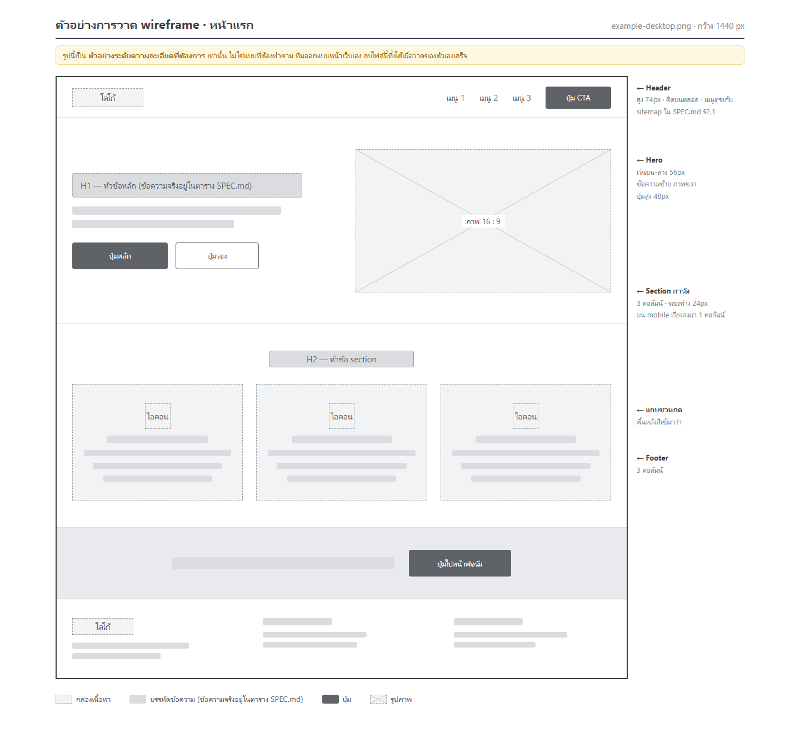

# wireframes/ — รูป wireframe จาก Figma

UI/UX วางไฟล์ PNG ที่ export จาก Figma (หรือรูปถ่ายกระดาษ) ไว้ที่นี่

---

## ดูตัวอย่างก่อน



`example-desktop.png` คือ **ตัวอย่างระดับความละเอียดที่ต้องการ**
ไม่ใช่แบบที่ต้องทำตาม — ทีมออกแบบหน้าเว็บเอง **ลบไฟล์นี้ทิ้งได้เมื่อวาดของตัวเองเสร็จ**

สังเกตจากตัวอย่าง 4 อย่าง:

1. **ไม่ต้องสวย ไม่ต้องมีสี** เทา ๆ ขาว ๆ ก็พอ — wireframe ไม่ใช่ดีไซน์
2. **บอกขนาดที่สำคัญ** เช่น สูง 74px, ระยะห่าง 24px, ปุ่มสูง 48px
3. **เขียนโน้ตข้าง ๆ** ว่าแต่ละส่วนทำงานยังไง โดยเฉพาะ *"บน mobile เรียงลงมา 1 คอลัมน์"*
4. **ข้อความจริงไม่ได้อยู่ในรูป** เป็นแค่แถบเทา ๆ แทนบรรทัด — ของจริงอยู่ในตาราง `SPEC.md`

---

## กติกาการตั้งชื่อ

```
<ชื่อหน้า>-<breakpoint>.png
```

| ตัวอย่าง | หมายถึง |
|---|---|
| `home-mobile.png` | หน้าแรก ที่ 375px |
| `home-desktop.png` | หน้าแรก ที่ 1440px |
| `quote-mobile.png` | หน้าขอใบเสนอราคา ที่ 375px |

- ใช้ **ตัวพิมพ์เล็กและขีดกลาง** เท่านั้น (Linux บน Vercel แยกตัวพิมพ์ใหญ่-เล็ก)
- Export **PNG @1x** ไฟล์ละไม่เกิน ~500KB (ตัวอย่างข้างบนขนาด 75KB)
- ต้องมีครบ **ทุกหน้า × (mobile + desktop)** ตาม sitemap ใน `SPEC.md` §2.1

---

## รูปพวกนี้ทำหน้าที่อะไร

บอก **สัดส่วน ลำดับสายตา ระยะห่าง** เท่านั้น

**ข้อความจริงทุกตัวอักษรต้องอยู่ในตารางใน `SPEC.md` ส่วนที่ 2**
เพราะ AI อ่านข้อความภาษาไทยตัวเล็ก ๆ ในรูปผิดบ่อย
ถ้าปล่อยให้ข้อความอยู่แต่ในรูป จะได้เว็บที่สะกดผิด

## สั่ง agent ให้อ่านรูปยังไง

ต้อง **บอก path ตรง ๆ** agent ถึงจะเปิดดู:

```
อ่าน docs/SPEC.md ส่วนที่ 2 กับรูป docs/wireframes/home-desktop.png
แล้วสร้างหน้าแรก — ข้อความเอาจากตารางใน SPEC.md ไม่ใช่จากรูป
```
